<h1 align="center">Hey! I'm Callum 👋</h1>
<h3 align="center">I'm an embedded software developer working in agriculture and a computer science student!</h3>

- 🌱 I’m currently using:
  - **Rust/C++** for general programming
  - **C++/C/ASM/Rust** for embedded programming
  - **Nix** for configuration management and dev environments

- 📫 If you need to contact me, please email **github@cleslie.uk**

  

---
